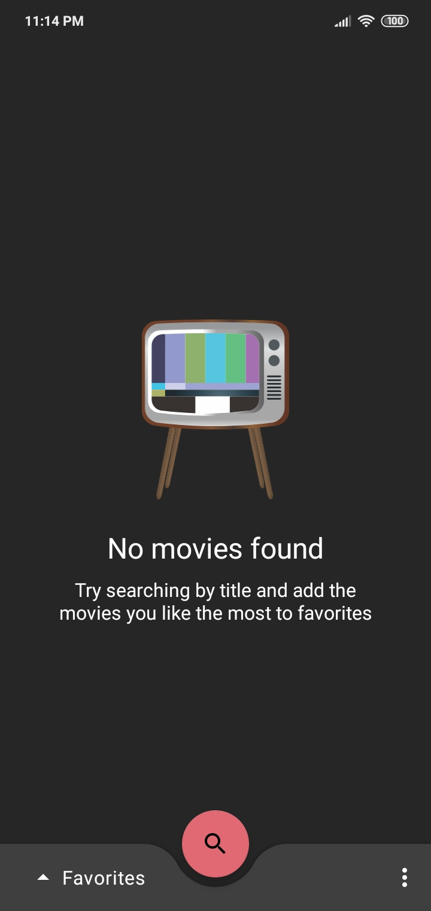

# MovieInfo

## Dark and Light mode support

  

## Multiple functionalities

## Empty states support

## Material Motion Transitions

## MAD Scorecard

Check the full MAD scorecard [here](https://madscorecard.withgoogle.com/scorecard/share/732461980/).

